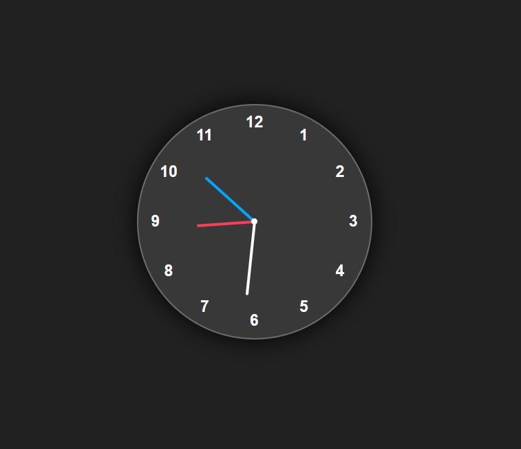

# Analog Clock ⏰

This is a simple and elegant analog clock built using HTML, CSS, and JavaScript. It visually displays the current time using rotating hour, minute, and second hands — just like a traditional wall clock.

## 🔧 Technologies Used

- **HTML** – for the structure
- **CSS** – for the clock styling and layout
- **JavaScript** – to calculate and rotate clock hands in real time

---

## 📐 Time Angle Calculation Logic

To animate the hands of the clock correctly, it's important to understand how the degrees are calculated:

### 📌 Hour Hand

- A full circle = 12 hours = 360°
- 1 hour = 360 / 12 = **30°**
- Additional movement per minute = **½° (0.5°)**
  
**Formula:**  
`Hour Angle = 30 × hours + 0.5 × minutes`

---

### 📌 Minute Hand

- 60 minutes = 360°
- 1 minute = 360 / 60 = **6°**
  
**Formula:**  
`Minute Angle = 6 × minutes`

---

### 📌 Second Hand

- 60 seconds = 360°
- 1 second = 360 / 60 = **6°**
  
**Formula:**  
`Second Angle = 6 × seconds`

---

## 🚀 How It Works

- JavaScript fetches the current time every second.
- Based on the formulas above, it rotates each hand accordingly using CSS `transform: rotate(...)`.
- The clock updates smoothly to reflect the current system time.

---

## 📸 Preview

---

## 📌 Author

Developed by Sahil Srivastava  
Feel free to use it, improve it, or include it in your projects!

