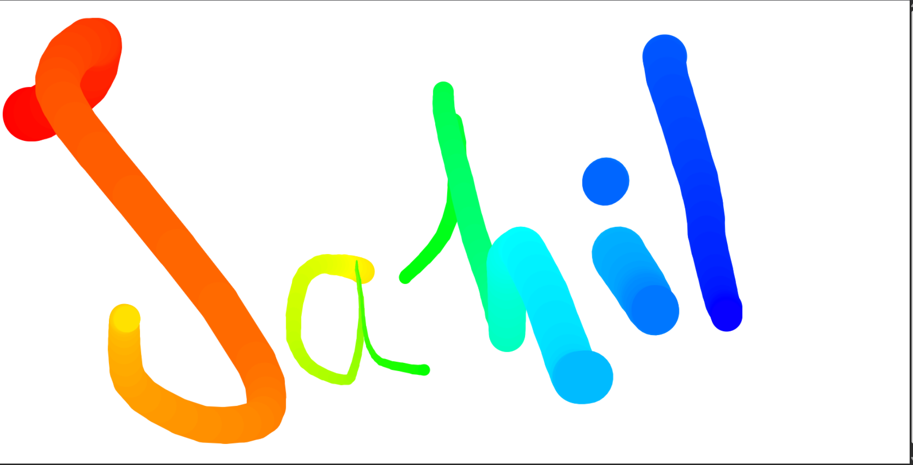

# 🎨 Interactive Canvas Drawing App

A lightweight, browser-based **interactive drawing application** built using pure **HTML5 Canvas and Vanilla JavaScript**. This project enables real-time drawing with dynamic colors and responsive stroke width—ideal for learning canvas APIs and mouse event handling.

---

## 📸 Preview

---

## 🚀 Features

- ✅ Full-screen responsive canvas  
- 🎨 Dynamic rainbow stroke colors using HSL  
- 🖌️ Auto-adjusting brush size (thick ↔ thin)  
- 🖱️ Mouse-based drawing support  
- ⚡ No libraries or frameworks — Pure JavaScript  
- 🌐 Runs directly in any modern browser  

---

## 🛠️ Tech Stack

- **HTML5**
- **CSS3**
- **JavaScript (Vanilla)**
- **Canvas API**

---

## 📂 Project Structure

│
├── index.html
├── preview.png
└── README.md

---

## ⚙️ How to Run Locally

1. Download or clone this repository.
2. Open `index.html` in your browser.
3. Start drawing instantly—no setup required.

---

## 🧠 How It Works

- Mouse events (`mousedown`, `mousemove`, `mouseup`, `mouseout`) control the drawing flow.
- `hsl()` dynamically updates stroke colors.
- Line width automatically increases and decreases between 1px and 100px.
- Canvas resizes dynamically to match the browser window.

All logic is written directly inside `index.html` using pure JavaScript and the HTML5 `<canvas>` element.

---

## 🔒 License

This project is open for learning and personal use. You may modify and distribute it freely for educational purposes.

---

## ⭐ Support & Contributions

If you find this project helpful:

- ⭐ Star the repository  
- 🍴 Fork the project  
- 🛠️ Add new features  
- 📢 Share it with fellow developers  

---

## ✅ Possible Future Upgrades

- Touch support for mobile devices  
- Color picker tool  
- Save drawing as image  
- Undo / Redo system  
- Pen pressure support for tablets  

---

**Built with creativity, logic, and clean JavaScript.**
