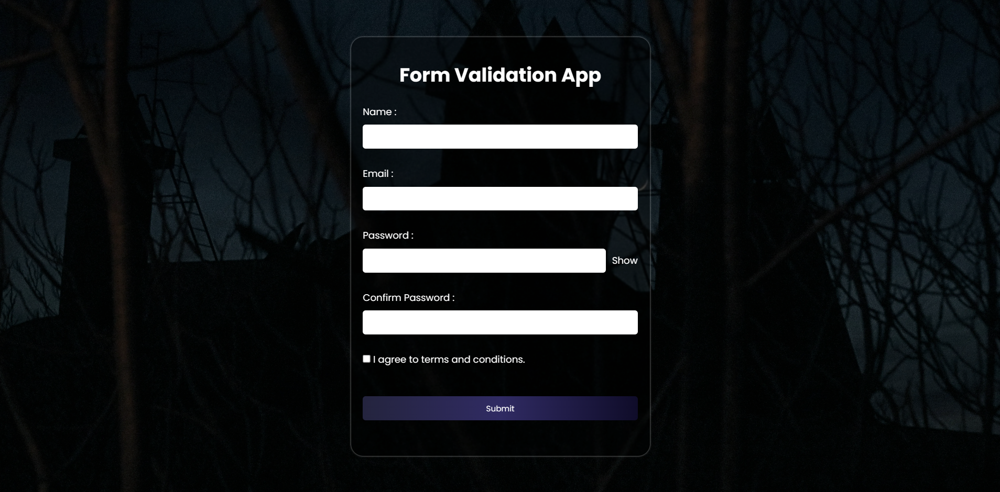

# Form Validation App

A responsive and interactive **Form Validation Application** built with **HTML, CSS, and Vanilla JavaScript** for learning and practicing frontend form handling, validation logic, and state-driven UI rendering.

---

## Preview



---

## Project Overview

This project demonstrates how to build a complete client-side form validation system without external libraries.

It includes:

- Real-time input validation
- Full-form validation on submit
- Password strength/rule validation
- Confirm password matching
- Show / Hide password toggle
- Terms & Conditions validation
- Success message handling
- Form reset after successful submission
- Centralized state and error management

---

## Features

### Name Validation
- Required field
- Minimum 3 characters
- Only letters and spaces allowed

### Email Validation
- Required field
- Regex-based email format validation

### Password Validation
Must contain:

- Minimum 8 characters
- At least 1 uppercase letter
- At least 1 lowercase letter
- At least 1 number
- At least 1 special character

### Confirm Password Validation
- Required field
- Must match password

### Terms & Conditions
- Checkbox required before submission

### UX Enhancements
- Live validation while typing
- Full validation on submit
- Success message after valid submission
- Success message clears when user starts editing again
- Password visibility toggle

---

## Tech Stack

- **HTML5**
- **CSS3**
- **JavaScript (Vanilla JS)**

---

## Architecture / Concepts Practiced

This project was built to practice and understand:

- DOM Selection & Traversal
- Event Handling
- Regex Validation
- State Management in Vanilla JS
- Error State Handling
- Dynamic UI Rendering
- Form Submission Logic
- Reset & Success Flow Management
- Modular Function Design

---

## Project Structure

```bash
form-validation-app/
│
├── index.html
├── styles.css
├── script.js
└── preview.png
```
Learning Highlights

Through this project, I practiced building a form validation system architecturally rather than procedurally by:

Maintaining centralized state and errors objects
Separating validation logic from UI rendering
Using reusable helper functions
Structuring code into logical sections for maintainability
Future Improvements

Potential upgrades for future versions:

Password strength meter
Touched/Dirty field tracking
Debounced validation
API submission simulation
LocalStorage draft saving
Dynamic validation rule engine
Author

Sahil Srivastava

License

This project is for learning and educational purposes.