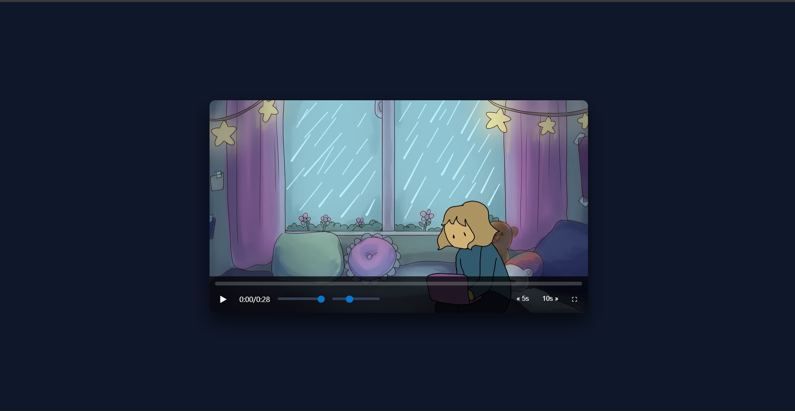

# 🎬 Custom HTML5 Video Player

A fully custom **HTML5 Video Player** built using **Vanilla JavaScript, CSS, and HTML**, focused on understanding **media APIs, event-driven UI, and real-world interaction patterns**.

---

## 🚀 Features

- ▶️ Play / Pause toggle
- ⏱️ Current time & total duration (`mm:ss` format)
- 📊 Interactive progress bar with scrubbing
- 🔊 Volume control
- ⚡ Playback speed control
- ⏩ Skip forward / backward (±5s, ±10s)
- 🖱️ Auto-hide controls on mouse inactivity
- 🖥️ Fullscreen toggle
- 📱 Responsive layout

---

## 🧠 Key Learning Outcomes

This project was built as a **learning-focused implementation**, not just a UI clone.

### 1️⃣ HTML5 Media API
- `video.play()`, `video.pause()`
- `video.currentTime`, `video.duration`
- `video.volume`, `video.playbackRate`
- Understanding that **media data loads asynchronously**

---

### 2️⃣ Media Lifecycle & Events
- `loadedmetadata` → when duration becomes available
- `timeupdate` → continuous UI sync
- Why events **do not replay** if missed
- Using `readyState` to avoid race conditions

---

### 3️⃣ UI Synchronization (State-driven UI)
- UI reacts to **video state**, not assumptions
- Icons update using `play` / `pause` events
- Progress bar synced using `currentTime / duration`

---

### 4️⃣ Mouse Activity Detection
- `mousemove` → detect user activity
- `mouseleave` → hide controls immediately
- Auto-hide logic using `setTimeout` + `clearTimeout`
- Understanding **debounce-style behavior**

---

### 5️⃣ Timers & Control Flow
- Proper use of `setTimeout` and `clearTimeout`
- Preventing multiple timers from stacking
- “Last user action wins” principle

---

### 6️⃣ Input Range Controls
- `<input type="range">` for volume & playback speed
- Using `input` / `change` events
- Mapping slider `name` directly to video properties

---

### 7️⃣ Time Formatting Logic
- Converting seconds → `mm:ss`
- Using `Math.floor`, `% 60`
- `padStart(2, "0")` for clean UI output

---

### 8️⃣ Fullscreen API
- Enter fullscreen: `element.requestFullscreen()`
- Exit fullscreen: `document.exitFullscreen()`
- Checking fullscreen state with `document.fullscreenElement`

---

### 9️⃣ Drag & Scrub Pattern
- Mouse down + move + up logic
- Boolean flag (`mousedown`) to control scrubbing
- Translating mouse position → video time

---

## 📁 Project Structure

├── index.html
├── style.css
├── script.js
├── preview.png
└── assets/
└── video.mp4

---

## 🛠️ Tech Stack

- **HTML5**
- **CSS3**
- **Vanilla JavaScript**
- No frameworks, no libraries

---

## 🎯 Why This Project Matters

This project helped me understand:

- How **real media players work internally**
- Why async behavior causes UI bugs
- How to think in **events, state, and lifecycle**
- Difference between “it works” and “it works correctly”

---

## 📌 Next Improvements (Optional)

- Keyboard shortcuts (space, arrows)
- Remaining time (`-02:15`)
- Touch support for mobile
- Accessibility (ARIA labels)
- Progress tooltip on hover

---

## 🙌 Acknowledgement

Built as a **learning-first project** to strengthen fundamentals in JavaScript, DOM events, and browser APIs.

---

**Made with focus, debugging, and curiosity.**
