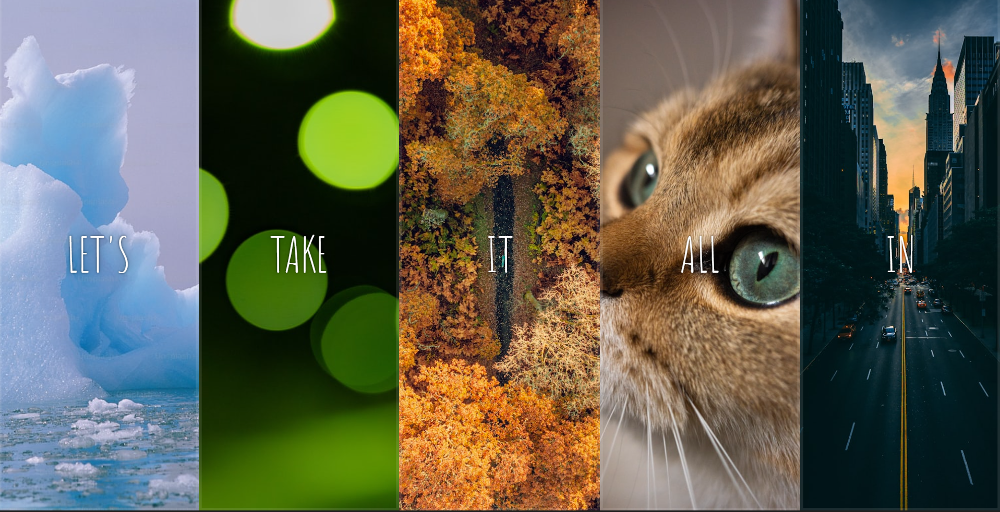

# 🎨 Flexbox Expanding Panels Gallery

An interactive image gallery built using **Flexbox, CSS transitions, and JavaScript**. Clicking a panel smoothly expands it using flex-grow animation while revealing hidden text using transform effects.

---

## 📸 Project Preview

> Before and after panel expansion:



---

## 🚀 Key Features

- Fully responsive using **Flexbox**
- Smooth expanding animation using `flex-grow`
- Text reveal using `transform` and `transition`
- Background images with cover and center positioning
- Simple JavaScript for toggling active states
- Clean UI with pure HTML, CSS, JavaScript (no frameworks)

---

## 🎯 Focus: Flexbox in This Project

Flexbox is the **core** of this entire layout and animation.

### 📌 Flexbox Usage Highlights

| CSS Property | Purpose |
|--------------|----------|
| `display: flex;` | Enables flex container (horizontal layout) |
| `flex: 1;` | Sets equal initial flex-basis for each panel |
| `flex-grow: 5;` | Expands selected panel smoothly |
| `flex-direction: column;` | Aligns text content vertically inside each panel |
| `justify-content: center;` | Centers content vertically |
| `align-items: center;` | Centers content horizontally |
| `flex: 1 0 auto;` | Prevents shrinking of child text panels |

---

### 🔍 Flex Effect in Action

```css
.panel {
  flex: 1; /* Default equal width */
  transition: flex 0.7s cubic-bezier(0.61, -0.19, 0.7, -0.11);
}

.panel.open {
  flex: 5; /* Expanded width */
}
