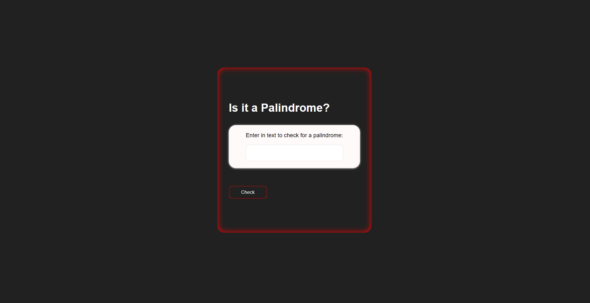

# Palindrome Checker 🔄

A simple web application built with **HTML**, **CSS**, and **JavaScript** to check whether a given text is a palindrome.  
This project was created as part of the **FreeCodeCamp JavaScript Algorithms and Data Structures certification**.

---

## 🚀 Features
- Checks if input text is a palindrome
- Ignores **case sensitivity**
- Ignores **spaces** and **punctuation**
- Alerts the user if input is empty
- Clean and responsive UI

---

## 📂 Project Structure
    ├── index.html   # Main HTML file
    ├── styles.css   # Styling for the app
    └── script.js    # JavaScript logic

---

## 🛠️ Technologies Used
- **HTML5**  
- **CSS3**  
- **JavaScript (ES6)**  

---

## 📸 Screenshots

