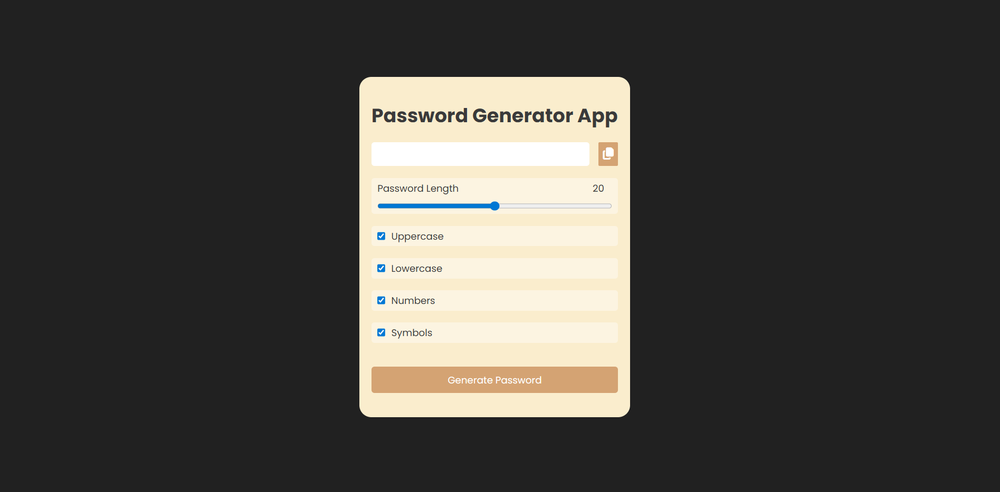

# 🔐 Password Generator App

A modern, responsive Password Generator built using **HTML, CSS, and JavaScript**, designed with a **state-driven architecture** and clean separation of concerns.

---

## 🚀 Features

- Generate secure random passwords
- Adjustable password length (8–32)
- Toggle options:
  - Uppercase letters
  - Lowercase letters
  - Numbers
  - Symbols
- Copy password to clipboard
- Validation: At least one option must be selected
- Clean and responsive UI

---

## 🧠 Architecture Overview

This project follows a **state-driven design pattern**:

```

UI → Event → State → Logic → UI Update

```

### Key Concepts Used:
- Centralized state management
- Separation of logic, UI, and events
- Pure functions for password generation
- Defensive UI handling

---

## 📁 Project Structure

```

📦 password-generator
├── index.html
├── styles.css
├── script.js
└── preview.png

````

---

## 🖥️ Preview



---

## ⚙️ How It Works

### 1. State Management
```js
const state = {
  length: 20,
  uppercase: true,
  lowercase: true,
  numbers: true,
  symbols: true
}
````

### 2. Password Generation Logic

* Builds a character pool based on selected options
* Randomly picks characters based on desired length

### 3. Validation

* Ensures at least one checkbox is selected
* Prevents invalid password generation

---

## 📋 Installation & Usage

1. Clone the repository:

```bash
git clone https://github.com/your-username/password-generator.git
```

2. Open the project:

```bash
cd password-generator
```

3. Run:

* Open `index.html` in your browser

---

## 💡 Future Enhancements

* Password strength indicator
* Copy success toast notification
* Dark/light mode toggle
* Save last generated password (localStorage)
* React version of the app

---

## 🧑‍💻 Tech Stack

* HTML5
* CSS3 (Flexbox)
* Vanilla JavaScript (ES6+)

---

## 📌 Learning Outcomes

* State-driven UI design
* Event handling and DOM manipulation
* Clean code structure and modular functions
* Real-world frontend architecture thinking

---

## 📜 License

This project is open-source and available under the MIT License.
