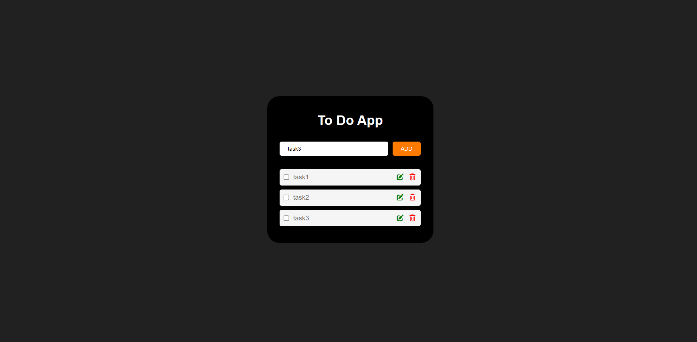

# 📝 Todo App (Vanilla JavaScript)

This is my **first JavaScript learning project**, built mostly by myself while learning how frontend applications work.

The goal of this project was not only to build a Todo list but also to understand **how JavaScript interacts with the DOM, manages state, and persists data using localStorage**.

---

# 🚀 Project Features

- Add new tasks
- Edit existing tasks
- Delete tasks
- Mark tasks as completed
- Persistent storage using **localStorage**
- Dynamic UI rendering using JavaScript
- Event delegation for efficient event handling

---

# 🛠 Technologies Used

- HTML
- CSS
- Vanilla JavaScript
- Browser `localStorage`

No frameworks or libraries were used. The goal was to understand **core JavaScript fundamentals**.

---

# 📸 Project Preview

Example:
Todo App UI

[ Add Task Input ] [ Add Button ]

☐ Learn JavaScript ✏️ 🗑
☑ Build Todo App ✏️ 🗑

---

# 🧠 What I Learned From This Project

This project helped me understand several important frontend concepts:

### 1. DOM Manipulation
Creating and updating elements dynamically using JavaScript.

Examples:
- `document.createElement`
- `append`
- `querySelector`
- `classList`

---

### 2. Event Delegation

Instead of adding listeners to every button, I used a **single listener on the container**.

Example concept:
listContainer.addEventListener("click", ...)
This makes the application more efficient and scalable.

---

### 3. Application State

The application uses an **array of objects** as its data source.

Example:
items = [
{ text: "Learn JavaScript", completed: false },
{ text: "Build Todo App", completed: true }
]

This array represents the **state of the application**.

---

### 4. UI Rendering Pattern

The UI is generated using a `render()` function.

Flow:

items array
↓
render()
↓
createTask()
↓
DOM elements displayed

Whenever the state changes, the UI is rebuilt.

---

### 5. Local Storage Persistence

Tasks remain saved even after refreshing the page.

Two functions manage persistence:

savedTasks()
loadItems()

Flow:

items updated
↓
savedTasks()
↓
localStorage

When the page loads:

loadItems()
↓
restore tasks
↓
render()

---

# 🔄 Application Flow

The application follows this pattern:

User Action
↓
Update items array
↓
savedTasks() → store in localStorage
↓
render() → update UI

This pattern is similar to how modern frontend frameworks manage state and UI.

---

# 📁 Project Structure

project-folder
│
├── index.html
├── style.css
├── script.js
└── README.md

---

# ⚠️ Known Limitations

Currently tasks are identified using their **text content**, which means duplicate tasks could cause issues.

Future improvements may include using **unique IDs** for each task.

---

# 🔮 Future Improvements

Possible improvements for this project:

- Use unique IDs for tasks
- Add task filtering (All / Completed / Pending)
- Improve UI design
- Add drag-and-drop task ordering
- Convert the project into a React application

---

# 💡 Personal Reflection

This was my **first JavaScript project built mostly independently**.  
While the code can still be improved, the main objective was to understand:

- DOM manipulation
- Event flow
- Application state
- Persistence using localStorage