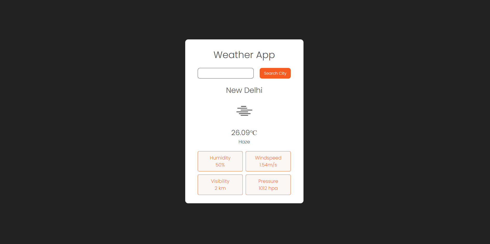

# 🌦️ Weather App

A clean and responsive weather application that fetches real-time weather data using the OpenWeather API. This project is built as part of a learning journey to understand API integration, asynchronous JavaScript, and UI state handling.

---

## 🚀 Features

* 🔍 Search weather by city name
* 🌡️ Displays temperature, weather condition, and icon
* 💧 Shows humidity, wind speed, visibility, and pressure
* ⚠️ Error handling for invalid city input
* ⌨️ Supports both button click and Enter key
* 📱 Responsive and minimal UI

---

## 🛠️ Tech Stack

* HTML5
* CSS3
* JavaScript (Vanilla JS)
* OpenWeather API

---

## 📸 Preview



---

## ⚙️ How to Run Locally

1. Clone the repository:

   ```bash
   git clone https://github.com/your-username/weather-app.git
   ```

2. Navigate to the project folder:

   ```bash
   cd weather-app
   ```

3. Open `index.html` in your browser

---

## 🔑 API Configuration

This project uses the OpenWeather API.

* Replace the API key in `script.js` with your own if needed:

  ```js
  const API = "your_api_key_here";
  ```

---

## 📚 Learning Outcomes

This project helped in understanding:

* Fetching data from APIs using `fetch()`
* Handling asynchronous operations with `async/await`
* DOM manipulation and dynamic UI updates
* Input validation and error handling
* Managing UI states (loading, error, success)

---

## 📌 Future Improvements

* 🌍 Add 5-day weather forecast
* 📍 Detect user location automatically
* 💾 Save recent searches using localStorage
* 🎨 Improve UI with animations and transitions

---

## 🙌 Acknowledgement

Weather data provided by [OpenWeather](https://openweathermap.org/)

---

## 📬 Feedback

Feel free to fork this project, suggest improvements, or use it for learning purposes.
